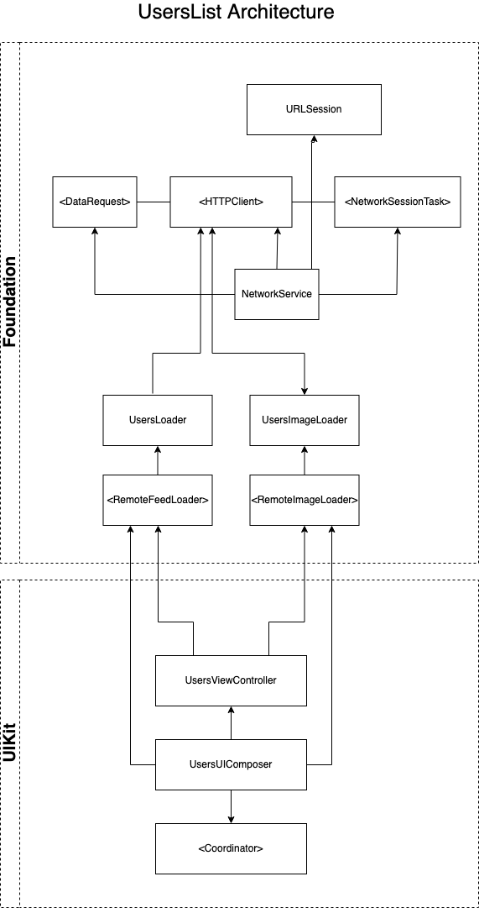

# RestCountries

## Description

Given a remote list of users, display them.
The list will mainly display a user’s name, surname, the user’s profile picture and email. As the user scrolls the list, more pages will be loaded from the APIs.

## Overview

- The project is ideally divided into folders, representing separate *modules/frameworks* (for simplicity).
- API is available in Rest, in this project was used the HTTPURLSessione, anyway other protocols can be added later according to clean architecture open to extensions.
- There are separate targets for each type of *testing* (**Unit**, End 2 End, Integration, UI) so that execution (and tests speed) can be separated.
- The **MVVM-C** pattern with coordinator was used to centralize navigation and decouple individual View Controllers that remain independent components of each other even through the necessary dependencies (Dependency Injection)
- All accompanied by an isolated test environment to test the behavior of individual components through their public interface. Using a **TDD** approach, starting with writing the test first and then the functionality.

## Architecture Diagram

